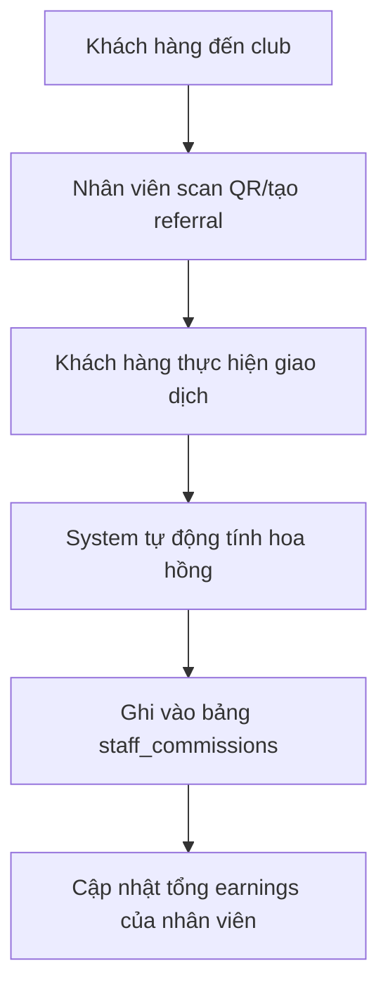

# 💰 GIẢI THÍCH CƠ CHẾ HOA HỒNG VÀ TRIGGER SYSTEM

## 🎯 **CÁCH NHÂN VIÊN NHẬN HOA HỒNG**

### **1. QUY TRÌNH HOẠT ĐỘNG**



### **2. CÁC LOẠI GIAO DỊCH CÓ HOA HỒNG**

#### **Tournament Fee (Phí giải đấu)**
```sql
-- Khách tham gia giải đấu
INSERT INTO customer_transactions (
    customer_id, club_id, staff_referral_id,
    transaction_type, amount, commission_eligible
) VALUES (
    'customer_123', 'club_456', 'referral_789',
    'tournament_fee', 100000, true  -- 100k VND
);
-- → Trigger tự động tính hoa hồng: 100000 × 5% = 5000 VND
```

#### **Table Booking (Đặt bàn chơi)**
```sql
-- Khách đặt bàn bi-a
INSERT INTO customer_transactions (
    customer_id, club_id, staff_referral_id,
    transaction_type, amount, commission_eligible
) VALUES (
    'customer_123', 'club_456', 'referral_789',
    'table_booking', 50000, true  -- 50k VND/giờ
);
-- → Trigger tự động tính: 50000 × 5% = 2500 VND
```

#### **Merchandise (Bán hàng)**
```sql
-- Khách mua đồ (cơ, phấn, v.v.)
INSERT INTO customer_transactions (
    customer_id, club_id, staff_referral_id,
    transaction_type, amount, commission_eligible
) VALUES (
    'customer_123', 'club_456', 'referral_789',
    'merchandise', 200000, true  -- Mua cơ bi-a
);
-- → Trigger tự động tính: 200000 × 5% = 10000 VND
```

---

## ⚡ **TRIGGER SYSTEM HOẠT ĐỘNG**

### **1. Trigger chính: `calculate_commission_trigger`**

```sql
-- Trigger kích hoạt MỖI KHI có giao dịch mới
CREATE TRIGGER calculate_commission_trigger
    AFTER INSERT ON customer_transactions
    FOR EACH ROW
    EXECUTE FUNCTION calculate_commission();
```

### **2. Function `calculate_commission()` - Tự động tính hoa hồng**

```sql
CREATE OR REPLACE FUNCTION calculate_commission()
RETURNS TRIGGER AS $$
DECLARE
    staff_record RECORD;
    commission_amount_calc NUMERIC;
BEGIN
    -- Chỉ xử lý nếu giao dịch đủ điều kiện hoa hồng
    IF NEW.commission_eligible = true AND NEW.staff_referral_id IS NOT NULL THEN
        
        -- Lấy thông tin nhân viên và tỷ lệ hoa hồng
        SELECT 
            cs.id as staff_id,
            cs.club_id,
            cs.commission_rate as staff_commission_rate,
            sr.commission_rate as referral_commission_rate
        INTO staff_record
        FROM club_staff cs
        JOIN staff_referrals sr ON sr.staff_id = cs.id
        WHERE sr.id = NEW.staff_referral_id;
        
        -- Tính hoa hồng (ưu tiên tỷ lệ riêng của referral)
        IF FOUND THEN
            commission_amount_calc := NEW.amount * (
                COALESCE(staff_record.referral_commission_rate, staff_record.staff_commission_rate) / 100
            );
            
            -- Tự động tạo record hoa hồng
            INSERT INTO staff_commissions (
                staff_id, club_id, customer_transaction_id,
                commission_type, commission_rate, 
                transaction_amount, commission_amount,
                earned_at
            ) VALUES (
                staff_record.staff_id,
                staff_record.club_id,
                NEW.id,
                CASE NEW.transaction_type
                    WHEN 'tournament_fee' THEN 'tournament_commission'
                    WHEN 'table_booking' THEN 'booking_commission' 
                    ELSE 'general_commission'
                END,
                COALESCE(staff_record.referral_commission_rate, staff_record.staff_commission_rate),
                NEW.amount,
                commission_amount_calc,
                NOW()
            );
            
            -- Cập nhật tổng hoa hồng của nhân viên
            UPDATE staff_referrals 
            SET total_commission_earned = COALESCE(total_commission_earned, 0) + commission_amount_calc
            WHERE id = NEW.staff_referral_id;
        END IF;
    END IF;
    
    RETURN NEW;
END;
$$ LANGUAGE plpgsql;
```

---

## 📊 **VÍ DỤ THỰC TẾ**

### **Scenario: Nhân viên Minh giới thiệu khách hàng An**

#### **Bước 1: Setup nhân viên**
```sql
-- Thêm Minh làm nhân viên với 7% hoa hồng
INSERT INTO club_staff (club_id, user_id, staff_role, commission_rate) 
VALUES ('club_saigon', 'minh_123', 'staff', 7.0);
```

#### **Bước 2: Tạo mối quan hệ giới thiệu**
```sql
-- Minh giới thiệu khách An với hoa hồng đặc biệt 10%
INSERT INTO staff_referrals (staff_id, customer_id, club_id, commission_rate)
VALUES ('staff_minh', 'customer_an', 'club_saigon', 10.0);
```

#### **Bước 3: Khách An thực hiện giao dịch**
```sql
-- An tham gia giải đấu 200k
INSERT INTO customer_transactions (
    customer_id, club_id, staff_referral_id,
    transaction_type, amount, commission_eligible
) VALUES (
    'customer_an', 'club_saigon', 'referral_minh_an',
    'tournament_fee', 200000, true
);

-- 🔥 TRIGGER TỰ ĐỘNG CHẠY:
-- Hoa hồng = 200,000 × 10% = 20,000 VND cho Minh
```

#### **Bước 4: Kết quả tự động**
```sql
-- System tự động tạo record trong staff_commissions:
{
    "staff_id": "staff_minh",
    "commission_amount": 20000,
    "commission_rate": 10.0,
    "transaction_amount": 200000,
    "commission_type": "tournament_commission",
    "is_paid": false,
    "earned_at": "2025-09-30T10:30:00Z"
}

-- Và cập nhật tổng earnings:
UPDATE staff_referrals 
SET total_commission_earned = total_commission_earned + 20000
WHERE id = 'referral_minh_an';
```

---

## 💳 **QUY TRÌNH THANH TOÁN HOA HỒNG**

### **1. Xem hoa hồng chưa thanh toán**
```sql
SELECT 
    sc.*,
    u.full_name as staff_name,
    ct.transaction_type,
    ct.description
FROM staff_commissions sc
JOIN club_staff cs ON cs.id = sc.staff_id
JOIN users u ON u.id = cs.user_id
JOIN customer_transactions ct ON ct.id = sc.customer_transaction_id
WHERE sc.club_id = 'club_saigon' 
AND sc.is_paid = false
ORDER BY sc.earned_at DESC;
```

### **2. Thanh toán hoa hồng**
```sql
-- Club owner thanh toán cho nhân viên
UPDATE staff_commissions 
SET 
    is_paid = true,
    paid_at = NOW(),
    payment_method = 'bank_transfer',
    payment_reference = 'TXN_20250930_001',
    payment_notes = 'Thanh toán hoa hồng tháng 9'
WHERE staff_id = 'staff_minh' 
AND club_id = 'club_saigon'
AND is_paid = false;
```

---

## 📈 **REPORTS & ANALYTICS**

### **1. Báo cáo hoa hồng nhân viên**
```sql
-- Tổng hoa hồng theo nhân viên trong tháng
SELECT 
    u.full_name,
    cs.staff_role,
    COUNT(*) as total_transactions,
    SUM(sc.transaction_amount) as total_revenue_generated,
    SUM(sc.commission_amount) as total_commissions,
    AVG(sc.commission_rate) as avg_commission_rate
FROM staff_commissions sc
JOIN club_staff cs ON cs.id = sc.staff_id
JOIN users u ON u.id = cs.user_id
WHERE sc.club_id = 'club_saigon'
AND sc.earned_at >= '2025-09-01'
AND sc.earned_at < '2025-10-01'
GROUP BY u.full_name, cs.staff_role
ORDER BY total_commissions DESC;
```

### **2. Top performers**
```sql
-- Top 5 nhân viên có hoa hồng cao nhất
SELECT 
    u.full_name,
    SUM(sc.commission_amount) as total_earned,
    COUNT(DISTINCT sr.customer_id) as customers_referred,
    AVG(sc.commission_amount) as avg_per_transaction
FROM staff_commissions sc
JOIN club_staff cs ON cs.id = sc.staff_id
JOIN users u ON u.id = cs.user_id
JOIN staff_referrals sr ON sr.staff_id = cs.id
WHERE sc.club_id = 'club_saigon'
GROUP BY u.full_name
ORDER BY total_earned DESC
LIMIT 5;
```

---

## 🎯 **TÓM TẮT CƠ CHẾ**

### **✅ Automatic (Tự động hoàn toàn)**
- Khách thực hiện giao dịch → Trigger tính hoa hồng → Ghi vào database
- Không cần can thiệp thủ công
- Realtime tracking

### **📊 Flexible (Linh hoạt)**
- Mỗi nhân viên có thể có tỷ lệ hoa hồng khác nhau
- Mỗi mối quan hệ giới thiệu có thể override tỷ lệ riêng
- Hỗ trợ nhiều loại giao dịch

### **🔒 Secure (Bảo mật)**
- RLS policies đảm bảo nhân viên chỉ xem được hoa hồng của mình
- Club owner quản lý toàn bộ
- Audit trail đầy đủ

### **💰 Transparent (Minh bạch)**
- Nhân viên thấy được từng giao dịch và hoa hồng tương ứng
- Lịch sử thanh toán chi tiết
- Analytics và báo cáo đầy đủ

**Hệ thống này hoàn toàn tự động hóa việc tính và theo dõi hoa hồng, giúp club owner quản lý nhân viên hiệu quả và nhân viên có động lực bán hàng cao hơn!** 🚀